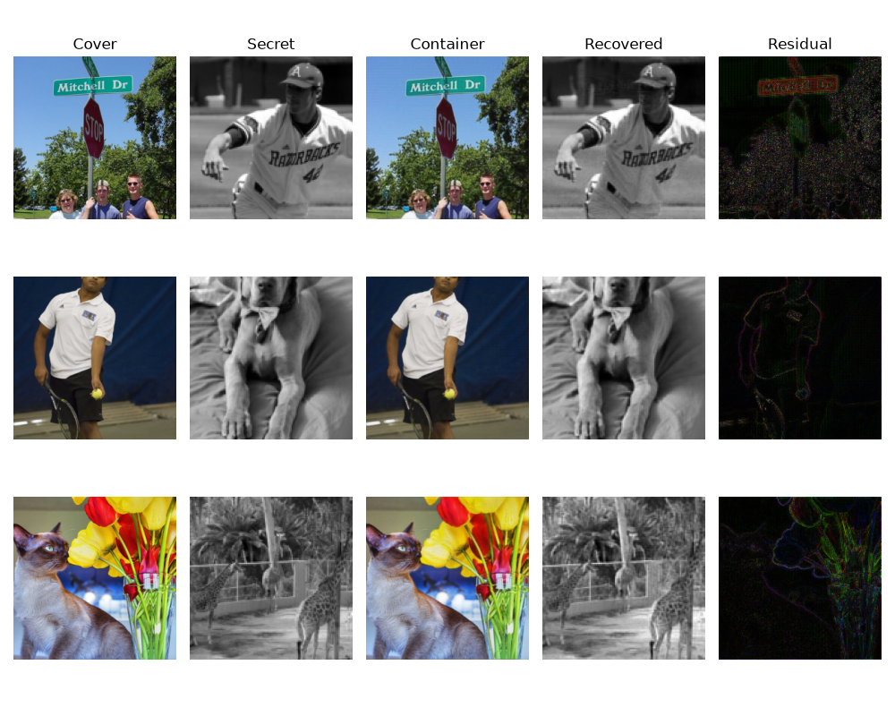
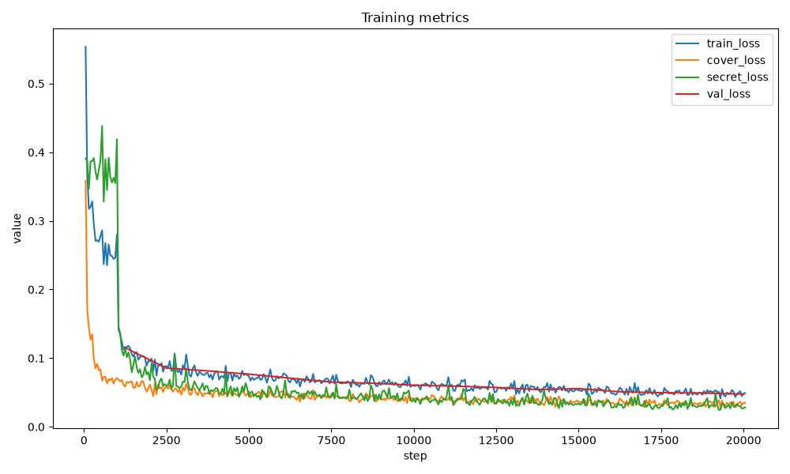

# Machine Learning Stegonography

In [1], Baluja presented a neural network architecture capable of hiding a full-color image inside another image of the same size. This project uses a similar approach; however, it aims to hide 128x128 grayscale images inside 256x256 full-color images. This reduces the strain on the hiding architecture, resulting in a payload capacity of 2 BPP. There were also some architectural changes made to allow the hiding network more freedom in hiding the secret image; this resulted in the secret image not being easily spotted in the residual (container − cover).

### Live demo

https://brtkkndrl.github.io/ml-steganography/

### Results

### Training

*Loss_cover = L2(cover, cover_hat) + δ * L1(cover, cover_hat)*

*Loss_secret = L1(secret, secret_hat) + δ * L1(secret, secret_hat)*

*Loss = Loss_cover + β * Loss_secret*

### Dataset
https://www.kaggle.com/datasets/trungit/coco25k

### References
[1] Shumeet Baluja. 2017. [Hiding images in plain sight: deep steganography.](https://proceedings.neurips.cc/paper_files/paper/2017/file/838e8afb1ca34354ac209f53d90c3a43-Paper.pdf)
